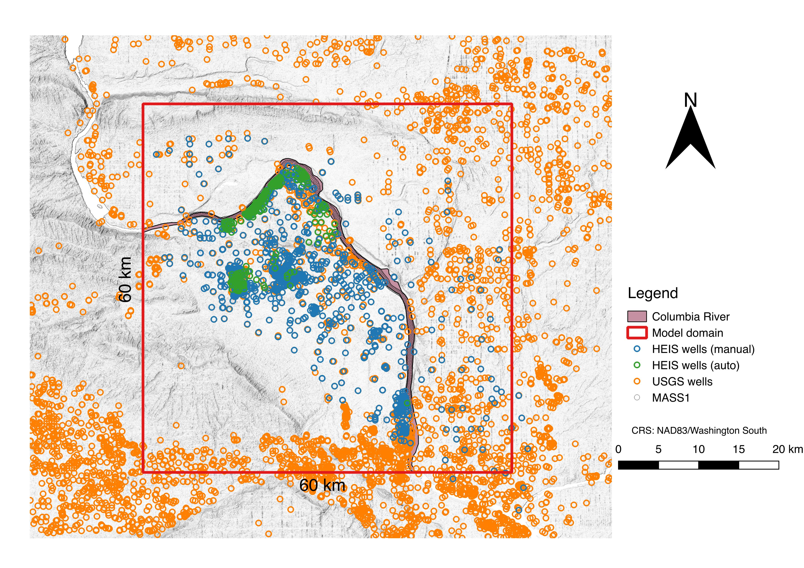
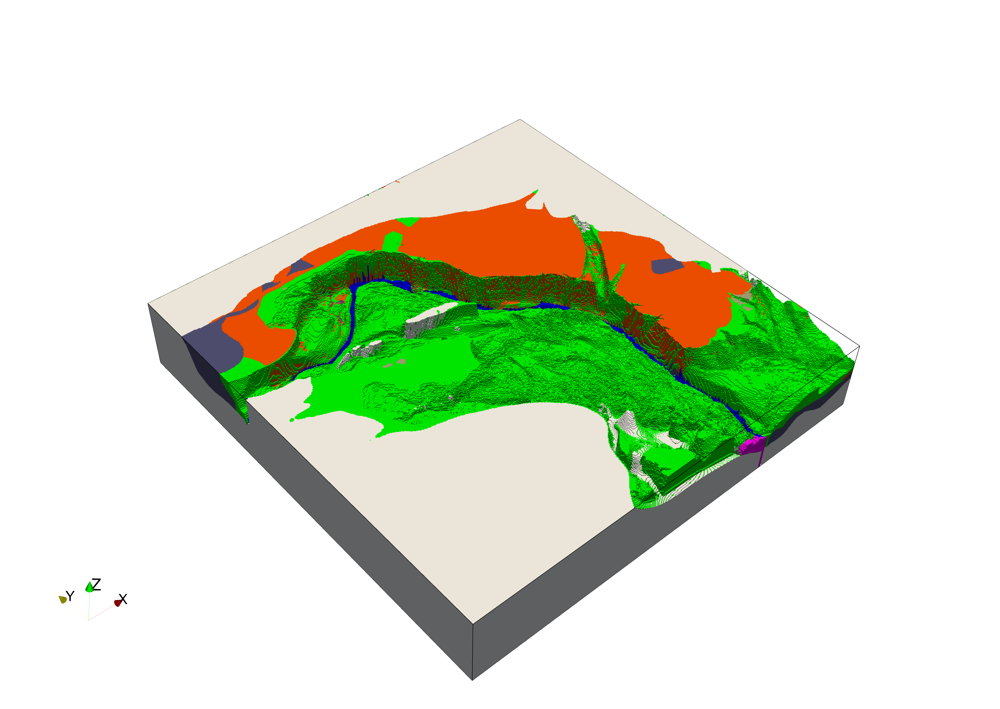
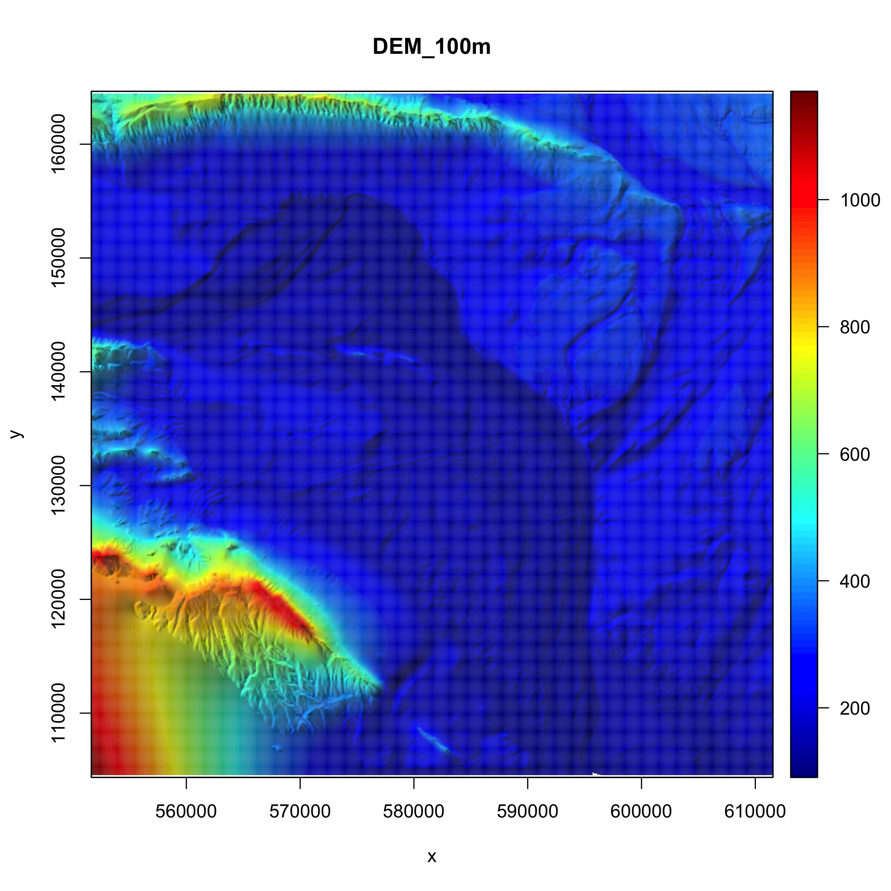
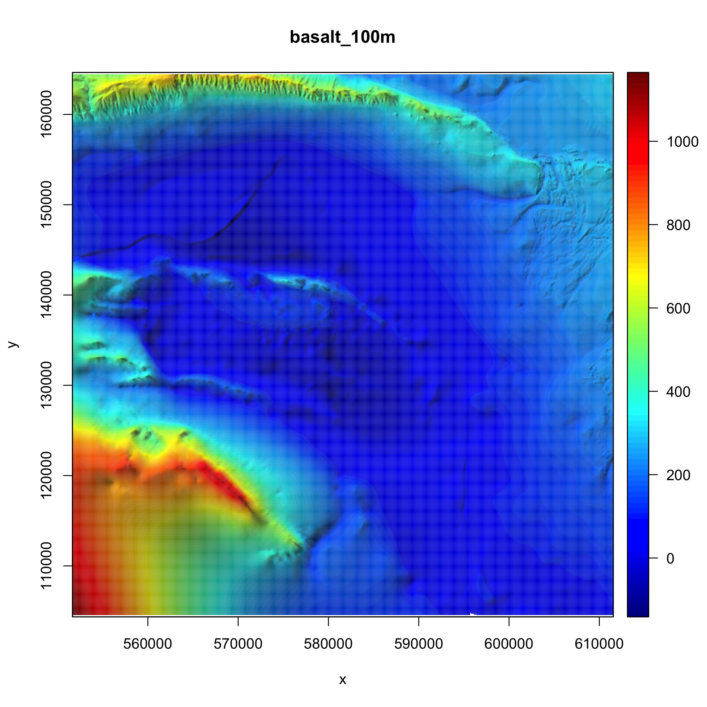
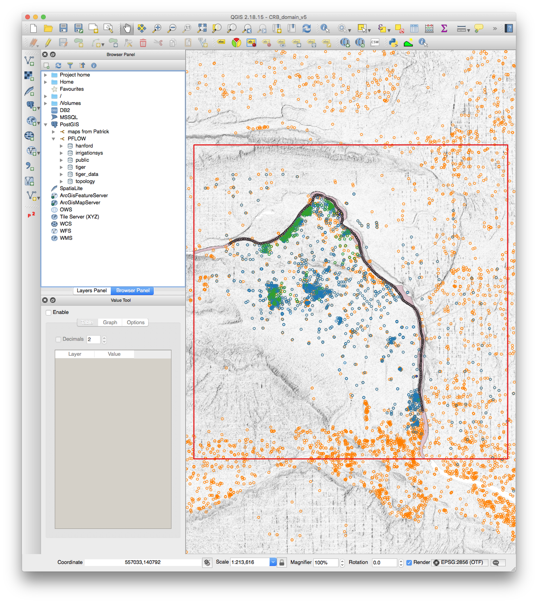
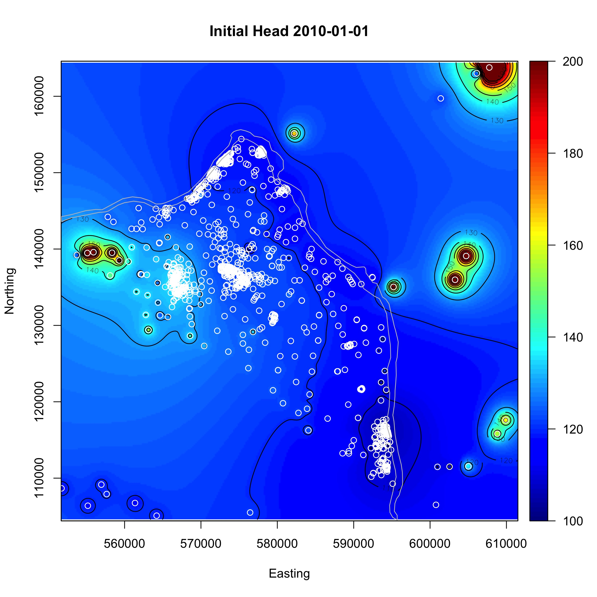
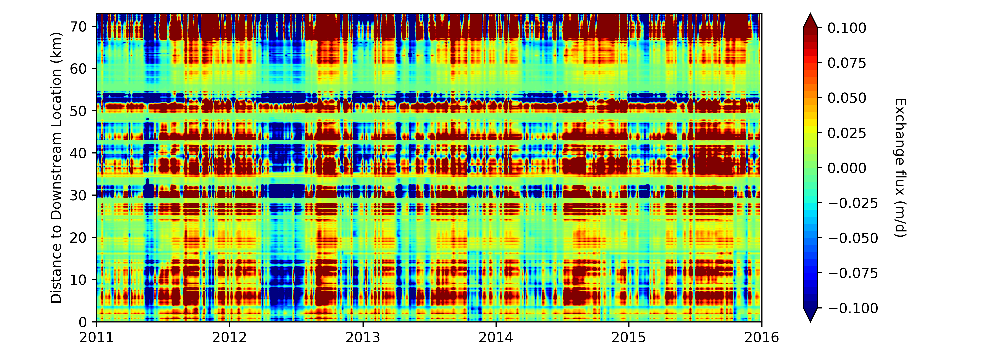

# Workflow for setting up reach scale model

## Table of Contents

* [1. initialize model configuration](#model-config)
* [2. pre-process](#pre-process)
    * [2.1 import geoframework](#import-geoframework)
    * [2.2 retrive data from SQL database](#SQL)
    * [2.3 generate material ids and river faces](#material-river-face)
    * [2.4 generate initial head for the domain](#initial-head)
    * [2.5 generate river boundary](#river-bc)
    * [2.6 generate PFLOTRAN input deck](#input_deck)
* [3. submit and run jobs on NERSC](#submit-and-run)
* [4. post-process](#post-process)
    * [4.1 plot tracer/age in Paraview](#plot-in-paraview)
    * [4.2 plot flux across riverbed from mass balance output](#plot-flux-from-massbalance)
    * [4.3 plot flux across riverbed from river cells](#plot-flux-from-river-cells)
        * [4.3.1 pre-process h5 output](#plot-flux-from-river-cells-1)
        * [4.3.2 generate flux bar plot](#plot-flux-from-river-cells-2)
    * [4.4 plot groundwater level](#plot-wl)
       

You can also find my github repository [here](https://github.com/pshuai88/notebook).

### 1. initialize model configuration 

Run [model_config.ipynb](model_config.ipynb) to configurate model setup (model domain, parameters...)

[return to the top](#top)

### 2.  pre-process

Provide PFLOTRAN inputs for the model.

[return to the top](#top)

#### 2.1 import geoframework

Run [import_geoframework.ipynb](import_geoframework.ipynb) to import geoframework for each unit.

Currently, there are six different geologic units. The hydraulic properties are listed below:

| Unit | Permeability ($m^{2}$) | Hydraulic conductivity ($m/d$) |
|------|:---------------:|-------------:|
|Hanford (Hf)|7e-09| 7000|
|Cold Creek (Cc)|1e-10|100|
|Ringold Taylor Flats (Rtf)|1e-12|1|
|Ringold E (Re)|4e-11|40|
|Ringold Lower Mud (Rlm)|1e-12|1|
|Ringold A (Ra)|1e-12|1|

#### 2.2 retrive data from SQL database

* Run [HEIS_data_retriever.ipynb](HEIS_data_retriever.ipynb) to retrive **well data** from HEIS. The common database names are listed here:

|Table name| Description|
|----------|------------|
|pflow.GW_SAMPLE_RESULTS_MV|HEIS--ALL groundwater chemistry data|
|pflow.well_construction_mv|HEIS--well construction data, includes depth, casing, and other fields|
|pflow.HYDRAULIC_HEAD_MV|HEIS--manual water level data|
|pflow.tblWells|HEIS--AWLN well information|
|pflow.tblProcessedData|HEIS--AWLN raw data (hourly)|
|pflow.vAwln|a view of Awln data that includes Hanford well names|

note: table name above begin with "v" indiates it is a view that Patrick created and it is not a token from HEIS, rather , it is a query based on the HEIS database.

* Run external GIS application (ArcGIS/QGIS) to retrive **GIS data** (such as well locations, geologic units and plumes) using PostgreSQL/PostGIS access.

#### 2.3 generate material ids and river faces

Run [material_river_face.ipynb](material_river_face.ipynb) to generate material ids and find all river cells. Material ids are listed below:

|Material id| Unit|
|-----------|-----|
|0|Inactive cells|
|1|Hf|
|2|Cc|
|3|Rtf|
|4|Re|
|5|Rlm|
|6|Ra|

#### 2.4 generate initial head for the domain

Run [initial_head.ipynb](initial_head.ipynb) to generate initial head for the model

#### 2.5 generate river boundary 

Run [river_bc.ipynb](river_bc.ipynb) to generate river bc from Mass1 simulations.

#### 2.6 generate PFLOTRAN input deck 

Run [PFLOTRAN_input.ipynb](PFLOTRAN_input.ipynb) to generate PFLOTRAN input deck.

### 3. submit and run jobs on NERSC 

Run [submit_job.ipynb](submit_job.ipynb) to submit and run jobs on NERSC.

### 4. post-process 

Post-process data from PFLOTRAN outputs and generate plots.

#### 4.1 plot tracer/age in Paraview 

Run [plot_in_Paraview.ipynb](plot_in_Paraview.ipynb) to generate plots using Paraview

#### 4.2 plot flux across riverbed from mass balance output 

Run [plot_flux_from_massBalance.ipynb](plot_flux_from_massBalance.ipynb) to generate flux across riverbed using mass balance ouput.

#### 4.3 plot flux across riverbed from river cells

##### 4.3.1 pre-process h5 output 

Run [plot_flux_from_river_cells-1.ipynb](plot_flux_from_river_cells-1.ipynb) to pre-process model snapshots.

##### 4.3.2 generate flux bar plot 

Run [plot_flux_from_river_cells-2.ipynb](plot_flux_from_river_cells-2.ipynb) to generate bar plots for riverbed flux.

#### 4.4 plot groundwater level

Run [plot_gw_level.ipynb](plot_gw_level.ipynb) to generate groundwater level animation.

[return to the top](#top)